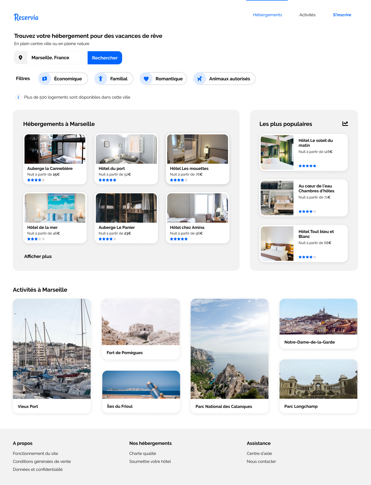

# Transformez une maquette en site web avec HTML & CSS

Démarrez sur HTML et CSS en intégrant la page Web de Reservia, une plateforme de réservation de vacances.

Vous avez trouvé votre premier stage en tant que développeur web chez Reservia, une petite entreprise proposant un outil de planification de vacances ! Son site permet aux usagers de trouver des hébergements et des activités dans la ville de leur choix. Les hébergements peuvent également être filtrés par thématique, par exemple leur budget ou leur ambiance.

Un nouveau design basé sur les principes du **Material Design** vient d’être réalisé par Loïc, designer UI.

> *Maquette of the Reservia website*

Avant de valider définitivement le design, l’entreprise a décidé de réaliser un prototype. Vous êtes chargé de créer ce **prototype** en intégrant la maquette en HTML et CSS.

Dans la matinée, Sarah, la CTO, vous envoie un e-mail pour vous donner les derniers détails sur le projet.

>
> :envelope:
>
> **De**: Sarah  
> **À**: Me  
> **Sujet**: Maquettes Reservia
>
> Bonjour,
>
> Ça y est, on a bien avancé sur le projet du site de Reservia. Tu vas t’occuper de l’intégration des maquettes de design en HTML / CSS, qui serviront de base de code pour le reste du développement. Du coup, voici les [nouvelles maquettes](https://course.oc-static.com/projects/Front-End+V2/P2+HTML+%26+CSS/DW+P2+-+Ressources+Reservia+FR.zip) qui ont été réalisées par Loïc pour les versions desktop et mobile. Le dossier comprend aussi les images à intégrer à la page.
>
> Pour que le projet soit très clair, voici quelques précisions qui te seront utiles pour l'intégration. Tu y trouveras nos spécifications de design, ainsi que les contraintes techniques à respecter.
>
> ### Fonctionnalités
> * Les usagers pourront rechercher des hébergements dans la ville de leur choix. Le champ de recherche est donc un champ de saisie, dont le texte peut être édité par l’usager. En revanche, à ce stade, le bouton de recherche ne sera pas fonctionnel.
> * Chaque carte d’hébergement ou d’activité devra être cliquable dans son intégralité. Pour l’instant les liens seront vides.
> * Les filtres ne seront pas fonctionnels pour cette version, en revanche, il faut qu’ils changent d’apparence au survol. Je te laisse décider de l’effet le plus approprié.
> * Dans le menu, les liens “Hébergements” et “Activités” sont des ancres qui doivent mener aux sections de la page.
>
> ### Contraintes techniques
> * Je te fournis deux maquettes : l’une desktop et l’autre mobile. Le site devra également être adapté aux tablettes. Sur ce support, tu es libre de faire les adaptations nécessaires avec la mise en page, tant qu’aucun élément n’est coupé et que le texte a une taille suffisante. Je te laisse choisir les breakpoints appropriés.
> * Comme je ne savais pas de quels tailles et formats d’image tu avais besoin, j’ai exporté les images en différents formats. Je te laisse choisir le format le plus adapté par rapport à la résolution et au temps de chargement.
> * Les icônes proviennent de la bibliothèque [Font Awesome](https://fontawesome.com/). Les couleurs de la charte sont le bleu #0065FC, et sa version plus claire #DEEBFF ainsi que le gris pour le fond #F2F2F2.
> * La police du site est [Raleway](https://fonts.google.com/specimen/Raleway).
>
> C’est tout pour moi. 
>
> Bon courage pour ce projet et bonne journée !
>
> --  
> Sarah  
> CTO  
> Reservia
>

Vous commencez par vous plonger dans l’étude des maquettes à l’aide d’un papier et d’un crayon. Cela vous permet de définir les grandes sections de la page avant de démarrer votre intégration. 

Bon courage !
